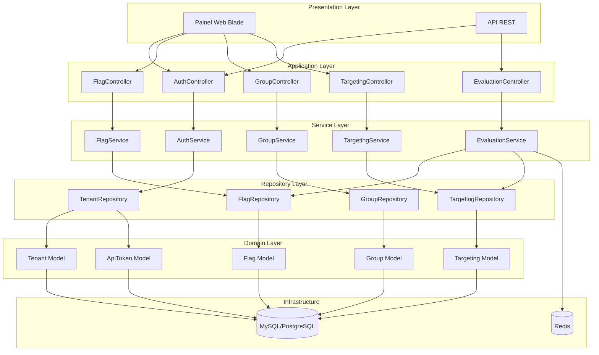
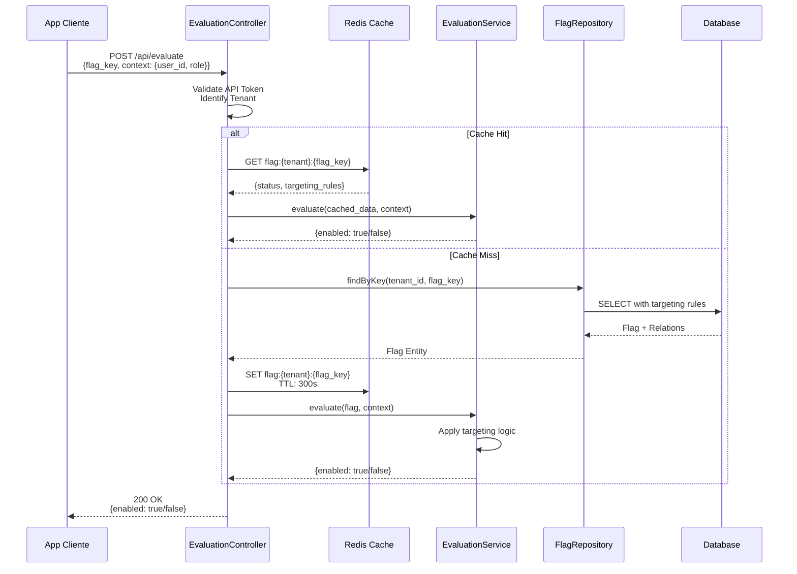
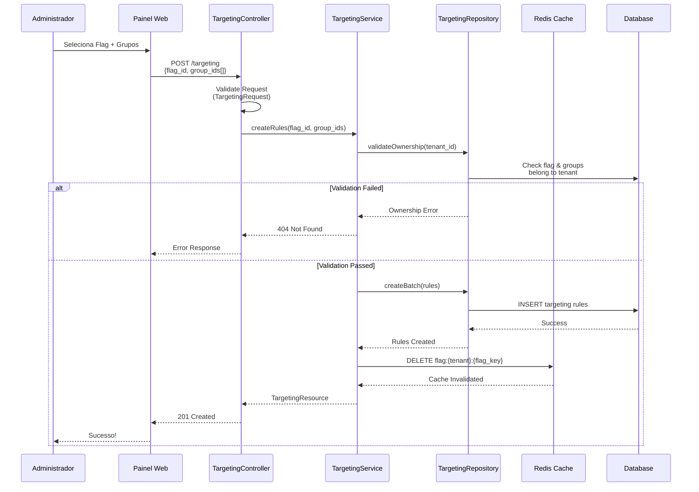
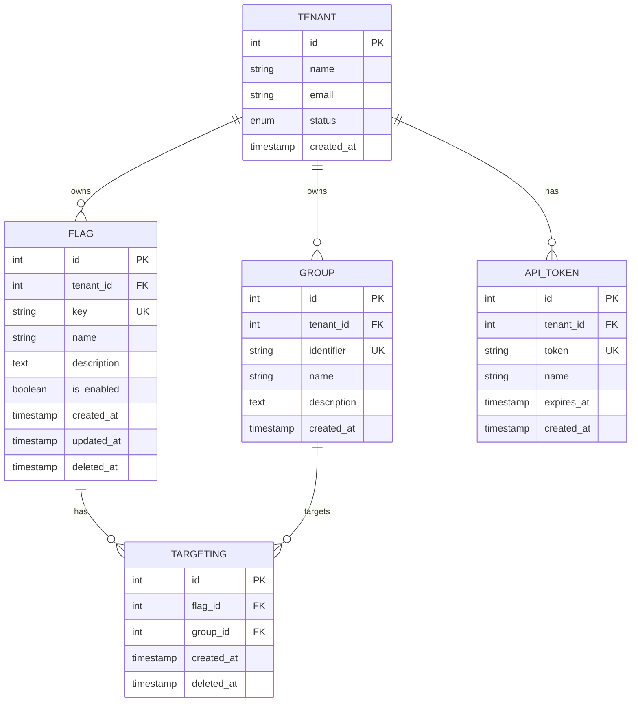

# Design Document - Feature Flag Service

## Overview

**Purpose**: Este sistema entrega um serviço multi-tenant de feature flags que permite controle granular de funcionalidades através de targeting contextual baseado em grupos e papéis, com painel administrativo web e API de avaliação de alta performance.

**Users**: Administradores de tenant utilizarão o painel web para gerenciar flags, grupos e regras de targeting. Aplicações cliente consumirão a API de avaliação para decisões em tempo real sobre exibição de funcionalidades.

**Impact**: Implementa uma arquitetura multi-tenant completa com isolamento de dados, seguindo o padrão Repository-Service do Laravel, com suporte a autenticação por token, gerenciamento visual via Blade e API otimizada para consultas.

### Goals
- Implementar serviço multi-tenant com isolamento completo de dados entre tenants
- Fornecer API de avaliação de flags com latência inferior a 50ms (p95)
- Criar painel web intuitivo com Blade para gerenciamento completo de flags, grupos e targeting
- Seguir padrão Laravel completo: Migration → Model → Repository → Service → Request → Controller → Resource → Route → Test
- Garantir cobertura de testes mínima de 80%

### Non-Goals
- Integração com provedores de identidade externos (OAuth, SAML) na primeira versão
- Analytics e dashboard de uso de flags (será considerado em versão futura)
- Suporte a percentual rollout (A/B testing) nesta iteração
- SDKs cliente para diferentes linguagens (foco inicial em REST API)
- Versionamento de flags e histórico de mudanças

## Architecture

### Architecture Pattern & Boundary Map



**Architecture Integration**:
- **Selected pattern**: Repository-Service Pattern com isolamento multi-tenant via Global Scopes
- **Domain boundaries**: Cinco domínios principais (Auth, Flags, Groups, Targeting, Evaluation) com responsabilidades claramente separadas
- **Existing patterns preserved**: Padrão MVC do Laravel, eloquent ORM, middleware pipeline
- **New components rationale**: 
  - Repository Layer: Encapsula queries complexas e lógica de acesso a dados
  - Service Layer: Orquestra regras de negócio e múltiplos repositories
  - Global Scopes: Garantem isolamento automático por tenant em todas as queries
- **Steering compliance**: Segue princípios de separação de responsabilidades e testabilidade

### Technology Stack

| Layer | Choice / Version | Role in Feature | Notes |
|-------|------------------|-----------------|-------|
| Frontend / CLI | Laravel Blade 10.x | Renderização do painel administrativo | Template engine nativo do Laravel, sem necessidade de build frontend |
| Backend / Services | PHP 8.2 + Laravel 10.x | Framework principal da aplicação | Suporte a typed properties, enums e pattern matching |
| Data / Storage | MySQL 8.0+ ou PostgreSQL 14+ | Persistência principal com suporte a JSON | Índices otimizados para queries multi-tenant |
| Cache | Redis 7.0+ | Cache de avaliação de flags | TTL configurável, estrutura: `flag:{tenant}:{flag_key}` |
| Authentication | Laravel Sanctum | API tokens + Web session | Nativo do Laravel, suporta ambos os modos |
| Testing | PHPUnit 10.x + Pest | Testes unitários e integração | Pest para sintaxe mais limpa |

## System Flows

### Fluxo de Avaliação de Feature Flag (Endpoint Crítico)



**Decisões do Fluxo**:
- Cache com TTL de 5 minutos para reduzir latência e carga no DB
- Estratégia cache-aside (lazy loading) para evitar stampede em flags raramente usadas
- Targeting evaluation em memória após cache hit/miss
- Fail-safe: retorna `false` se flag não existir (feature desabilitada por padrão)

### Fluxo de Criação de Regra de Targeting



**Decisões do Fluxo**:
- Validação de ownership em nível de Service para garantir isolamento multi-tenant
- Invalidação de cache imediata após mudança em regras
- Criação em batch para performance quando múltiplos grupos são associados
- Response com TargetingResource formatado consistentemente

## Requirements Traceability

| Requirement | Summary | Components | Interfaces | Flows |
|-------------|---------|------------|------------|-------|
| 1 | Autenticação Multi-Tenant | AuthService, TenantRepository, ApiToken Model | API Token Middleware, Web Auth Routes | - |
| 2 | Gerenciamento de Flags | FlagService, FlagRepository, Flag Model | FlagController (API + Web), FlagResource | - |
| 3 | Gerenciamento de Grupos | GroupService, GroupRepository, Group Model | GroupController, GroupResource | - |
| 4 | Regras de Targeting | TargetingService, TargetingRepository, Targeting Model | TargetingController, TargetingResource | Fluxo de Criação de Targeting |
| 5 | Avaliação de Flags | EvaluationService, FlagRepository, Cache | EvaluationController (Public API) | Fluxo de Avaliação (Crítico) |
| 6 | Painel Web | Blade Views, Web Controllers | Web Routes com Session Auth | - |
| 7 | Isolamento Multi-Tenant | TenantScope (Global Scope), Middleware | Aplicado em todos os Models multi-tenant | - |
| 8 | Ciclo de Desenvolvimento | Toda a arquitetura | Migration → Model → Repository → Service → Request → Controller → Resource → Route → Test | - |

## Components and Interfaces

### Domain / Models

| Component | Domain/Layer | Intent | Req Coverage | Key Dependencies (P0/P1) | Contracts |
|-----------|--------------|--------|--------------|--------------------------|-----------|
| Tenant | Domain | Representa um tenant isolado no sistema | 1, 7 | ApiToken (P0) | Model |
| Flag | Domain | Entidade de feature flag com status global | 2, 5, 7 | Tenant (P0), Targeting (P1) | Model, Scope |
| Group | Domain | Grupo de usuários/papéis para targeting | 3, 7 | Tenant (P0) | Model, Scope |
| Targeting | Domain | Regra de associação flag ↔ group | 4, 7 | Flag (P0), Group (P0) | Model, Scope |
| ApiToken | Domain | Token de autenticação por tenant | 1 | Tenant (P0) | Model |

#### Tenant Model

| Field | Detail |
|-------|--------|
| Intent | Representa a raiz do isolamento multi-tenant, cada tenant possui flags, grupos e tokens próprios |
| Requirements | 1, 7 |

**Responsibilities & Constraints**
- Root aggregate do domínio multi-tenant
- Ownership de todas as entidades filhas (flags, groups, tokens)
- Geração e validação de API tokens

**Dependencies**
- Outbound: ApiToken — geração de tokens de autenticação (P0)
- Outbound: Flag, Group — relacionamentos hasMany (P0)

**Contracts**: State [x]

##### State Management
```php
class Tenant extends Model
{
    protected $fillable = ['name', 'email', 'status'];
    
    protected $casts = [
        'status' => TenantStatus::class, // enum: active, suspended, deleted
        'created_at' => 'datetime',
    ];
    
    // Relationships
    public function apiTokens(): HasMany;
    public function flags(): HasMany;
    public function groups(): HasMany;
}

enum TenantStatus: string
{
    case ACTIVE = 'active';
    case SUSPENDED = 'suspended';
    case DELETED = 'deleted';
}
```

**Implementation Notes**
- Status enum para controle de estado do tenant
- Soft deletes para auditoria
- UUID como identificador alternativo para API pública

#### Flag Model

| Field | Detail |
|-------|--------|
| Intent | Representa uma feature flag com status global e targeting opcional |
| Requirements | 2, 5, 7 |

**Responsibilities & Constraints**
- Armazena estado global (enabled/disabled) da flag
- Mantém integridade com regras de targeting
- Garante unicidade de `key` por tenant

**Dependencies**
- Inbound: Tenant — ownership (P0)
- Outbound: Targeting — regras de targeting (P1)

**Contracts**: State [x]

##### State Management
```php
class Flag extends Model
{
    use SoftDeletes;
    
    protected $fillable = ['tenant_id', 'key', 'name', 'description', 'is_enabled'];
    
    protected $casts = [
        'is_enabled' => 'boolean',
        'created_at' => 'datetime',
        'updated_at' => 'datetime',
    ];
    
    // Global Scope para isolamento multi-tenant
    protected static function booted()
    {
        static::addGlobalScope(new TenantScope);
    }
    
    // Relationships
    public function tenant(): BelongsTo;
    public function targetingRules(): HasMany;
    
    // Business Logic
    public function hasTargeting(): bool
    {
        return $this->targetingRules()->exists();
    }
}
```

**Implementation Notes**
- TenantScope aplicado globalmente para filtragem automática
- Índice único composto: (tenant_id, key) para garantir unicidade
- Soft deletes com cascade de targeting rules

#### Group Model

| Field | Detail |
|-------|--------|
| Intent | Representa grupo de usuários/papéis para associação com flags |
| Requirements | 3, 7 |

**Responsibilities & Constraints**
- Agrupa contextos de usuários para targeting
- Mantém identificador único por tenant
- Isolamento via TenantScope

**Dependencies**
- Inbound: Tenant — ownership (P0)
- Outbound: Targeting — associações com flags (P1)

**Contracts**: State [x]

##### State Management
```php
class Group extends Model
{
    protected $fillable = ['tenant_id', 'identifier', 'name', 'description'];
    
    protected $casts = [
        'created_at' => 'datetime',
    ];
    
    protected static function booted()
    {
        static::addGlobalScope(new TenantScope);
    }
    
    // Relationships
    public function tenant(): BelongsTo;
    public function targetingRules(): HasMany;
}
```

**Implementation Notes**
- Índice único: (tenant_id, identifier)
- Identifier usado para matching no contexto de avaliação

#### Targeting Model

| Field | Detail |
|-------|--------|
| Intent | Representa associação many-to-many entre flags e grupos |
| Requirements | 4, 7 |

**Responsibilities & Constraints**
- Tabela pivot enriquecida com lógica de validação
- Garante que flag e group pertencem ao mesmo tenant
- Suporta soft deletes para auditoria

**Dependencies**
- Inbound: Flag — flag sendo targetada (P0)
- Inbound: Group — grupo alvo (P0)

**Contracts**: State [x]

##### State Management
```php
class Targeting extends Model
{
    use SoftDeletes;
    
    protected $table = 'flag_targeting';
    
    protected $fillable = ['flag_id', 'group_id'];
    
    protected $casts = [
        'created_at' => 'datetime',
    ];
    
    protected static function booted()
    {
        static::addGlobalScope(new TenantScope);
    }
    
    // Relationships
    public function flag(): BelongsTo;
    public function group(): BelongsTo;
}
```

**Implementation Notes**
- Índice único: (flag_id, group_id) para evitar duplicatas
- TenantScope aplicado via relacionamentos
- Cascade delete quando flag ou group é deletado

### Repository Layer

| Component | Domain/Layer | Intent | Req Coverage | Key Dependencies (P0/P1) | Contracts |
|-----------|--------------|--------|--------------|--------------------------|-----------|
| TenantRepository | Data Access | Encapsula queries relacionadas a tenants e tokens | 1 | Tenant Model (P0) | Service |
| FlagRepository | Data Access | Queries complexas de flags com targeting | 2, 5 | Flag Model (P0) | Service |
| GroupRepository | Data Access | Gerenciamento de grupos por tenant | 3 | Group Model (P0) | Service |
| TargetingRepository | Data Access | Queries de associação flag-group | 4 | Targeting Model (P0) | Service |

#### FlagRepository

| Field | Detail |
|-------|--------|
| Intent | Encapsular queries complexas de flags incluindo eager loading de targeting rules |
| Requirements | 2, 5 |

**Responsibilities & Constraints**
- Queries otimizadas com eager loading para evitar N+1
- Validação de ownership em queries cross-tenant
- Cache-friendly data structures

**Dependencies**
- Inbound: FlagService, EvaluationService (P0)
- Outbound: Flag Model, Targeting Model (P0)

**Contracts**: Service [x]

##### Service Interface
```php
interface FlagRepositoryInterface
{
    public function findById(int $id): ?Flag;
    
    public function findByKey(int $tenantId, string $key): ?Flag;
    
    public function findByKeyWithTargeting(int $tenantId, string $key): ?Flag;
    
    public function getAllForTenant(int $tenantId, array $filters = []): Collection;
    
    public function create(array $data): Flag;
    
    public function update(Flag $flag, array $data): bool;
    
    public function delete(Flag $flag): bool;
}
```

**Preconditions**:
- tenant_id deve ser válido e existir
- key deve seguir formato slug (lowercase, alphanumeric, hyphens)

**Postconditions**:
- Dados retornados sempre filtrados por tenant
- Relacionamentos eager loaded quando especificado

**Invariants**:
- Unicidade de (tenant_id, key) sempre mantida
- Soft deletes preservados para auditoria

**Implementation Notes**
- `findByKeyWithTargeting` eager loads `targetingRules.group` para evitar N+1
- Queries utilizam prepared statements para segurança
- Índices otimizados: (tenant_id, key), (tenant_id, is_enabled)

#### TargetingRepository

| Field | Detail |
|-------|--------|
| Intent | Gerenciar associações flag-group com validação de ownership |
| Requirements | 4 |

**Responsibilities & Constraints**
- Validar que flag e groups pertencem ao mesmo tenant
- Suportar criação em batch para performance
- Invalidação de cache após modificações

**Dependencies**
- Inbound: TargetingService (P0)
- Outbound: Targeting Model, Flag Model, Group Model (P0)

**Contracts**: Service [x]

##### Service Interface
```php
interface TargetingRepositoryInterface
{
    public function createBatch(int $flagId, array $groupIds): Collection;
    
    public function getRulesForFlag(int $flagId): Collection;
    
    public function deleteRulesForFlag(int $flagId): int;
    
    public function deleteRule(int $flagId, int $groupId): bool;
    
    public function validateOwnership(int $tenantId, int $flagId, array $groupIds): bool;
}
```

**Preconditions**:
- flag_id e group_ids devem existir
- Todos os IDs devem pertencer ao mesmo tenant

**Postconditions**:
- Associações criadas atomicamente (transação)
- Cache de flag invalidado após mudanças

**Invariants**:
- Não podem existir regras duplicadas (flag_id, group_id)
- Integridade referencial mantida via foreign keys

**Implementation Notes**
- `createBatch` usa transaction para atomicidade
- `validateOwnership` executa query única com subqueries para performance
- Triggers de invalidação de cache após INSERT/UPDATE/DELETE

### Service Layer

| Component | Domain/Layer | Intent | Req Coverage | Key Dependencies (P0/P1) | Contracts |
|-----------|--------------|--------|--------------|--------------------------|-----------|
| AuthService | Business Logic | Autenticação de tenants e geração de tokens | 1 | TenantRepository (P0) | Service |
| FlagService | Business Logic | Orquestração de CRUD de flags com regras de negócio | 2 | FlagRepository (P0) | Service |
| GroupService | Business Logic | Gerenciamento de grupos com validações | 3 | GroupRepository (P0) | Service |
| TargetingService | Business Logic | Lógica de associação flag-group com validação | 4 | TargetingRepository (P0), FlagRepository (P1) | Service |
| EvaluationService | Business Logic | Motor de avaliação de flags com targeting | 5 | FlagRepository (P0), Cache (P0) | Service |

#### EvaluationService (Componente Crítico)

| Field | Detail |
|-------|--------|
| Intent | Motor de avaliação de flags aplicando lógica de targeting em tempo real |
| Requirements | 5 |

**Responsibilities & Constraints**
- Decidir se flag está enabled para contexto específico
- Aplicar lógica: targeting rules > status global > fail-safe (false)
- Performance target: < 50ms p95
- Cache-aware para minimizar DB hits

**Dependencies**
- Inbound: EvaluationController (P0)
- Outbound: FlagRepository (P0), Redis Cache (P0)

**Contracts**: Service [x]

##### Service Interface
```php
interface EvaluationServiceInterface
{
    public function evaluate(
        int $tenantId, 
        string $flagKey, 
        EvaluationContext $context
    ): EvaluationResult;
    
    public function evaluateBatch(
        int $tenantId,
        array $flagKeys,
        EvaluationContext $context
    ): array;
}

class EvaluationContext
{
    public function __construct(
        public readonly string $userId,
        public readonly string $role,
        public readonly array $metadata = []
    ) {}
}

class EvaluationResult
{
    public function __construct(
        public readonly bool $enabled,
        public readonly string $reason,
        public readonly ?string $variant = null
    ) {}
}
```

**Preconditions**:
- tenant_id válido e ativo
- flagKey existente (ou retorna false por fail-safe)
- context.role deve corresponder a um group identifier

**Postconditions**:
- Retorna decisão determinística para mesmo input
- Cache populado após miss (TTL 5min)

**Invariants**:
- Sempre retorna false para flags inexistentes (fail-safe)
- Targeting rules têm precedência sobre status global

**Implementation Notes**
**Evaluation Logic**:
```php
// Pseudo-código da lógica de avaliação
if (flag.hasTargeting()) {
    return flag.targetingRules->contains('group.identifier', context.role);
}
return flag.is_enabled;
```

**Cache Strategy**:
- Key format: `flag:{tenant_id}:{flag_key}`
- Stored data: serialized flag with targeting rules
- TTL: 300 seconds (5 minutes)
- Invalidation: on flag update, targeting rule change, or flag deletion

**Performance Optimizations**:
- Single query com eager loading de targeting rules
- Evaluation logic em memória (sem queries adicionais)
- Cache warming opcional para flags críticas

**Risks**:
- Cache stale por até 5 minutos após mudança (aceitável segundo requisitos)
- Thundering herd em cache miss (mitigado com lock ou probabilistic early expiration)

#### TargetingService

| Field | Detail |
|-------|--------|
| Intent | Orquestrar criação de regras de targeting com validação de ownership multi-tenant |
| Requirements | 4 |

**Responsibilities & Constraints**
- Validar que flag e groups pertencem ao mesmo tenant antes de criar regras
- Orquestrar cache invalidation após mudanças
- Transações atomicas para batch operations

**Dependencies**
- Inbound: TargetingController (P0)
- Outbound: TargetingRepository (P0), FlagRepository (P1), Cache (P1)

**Contracts**: Service [x]

##### Service Interface
```php
interface TargetingServiceInterface
{
    public function createRules(int $tenantId, int $flagId, array $groupIds): Collection;
    
    public function removeRule(int $tenantId, int $flagId, int $groupId): bool;
    
    public function replaceRules(int $tenantId, int $flagId, array $groupIds): Collection;
    
    public function getRulesForFlag(int $tenantId, int $flagId): Collection;
}
```

**Preconditions**:
- tenant_id, flag_id e group_ids válidos
- Flag e groups devem pertencer ao tenant

**Postconditions**:
- Regras criadas atomicamente (all-or-nothing)
- Cache da flag invalidado
- Event disparado para auditoria

**Invariants**:
- Ownership validation sempre executada antes de persistence
- Transações rollback em caso de falha de validação

**Implementation Notes**
**Validation Flow**:
```php
// 1. Validate ownership
if (!$this->targetingRepo->validateOwnership($tenantId, $flagId, $groupIds)) {
    throw new UnauthorizedException("Resources not found or don't belong to tenant");
}

// 2. Execute in transaction
DB::transaction(function () use ($flagId, $groupIds) {
    $rules = $this->targetingRepo->createBatch($flagId, $groupIds);
    $this->invalidateCache($flagId);
    event(new TargetingRulesCreated($flagId, $groupIds));
    return $rules;
});
```

**Integration**:
- Usa DB transactions para atomicidade
- Dispatcha events para auditoria/observability
- Cache invalidation síncrona (blocking)

**Risks**:
- Validação de ownership com muitos group_ids pode ser lenta (mitigado com query otimizada)
- Cache invalidation failure não bloqueia operação (logged como warning)

### Controller Layer

| Component | Domain/Layer | Intent | Req Coverage | Key Dependencies (P0/P1) | Contracts |
|-----------|--------------|--------|--------------|--------------------------|-----------|
| FlagController | HTTP/API | Endpoints REST para CRUD de flags | 2 | FlagService (P0) | API, Service |
| GroupController | HTTP/API | Endpoints REST para grupos | 3 | GroupService (P0) | API, Service |
| TargetingController | HTTP/API | Endpoints para gerenciar targeting rules | 4 | TargetingService (P0) | API, Service |
| EvaluationController | HTTP/API | Endpoint público de avaliação (crítico) | 5 | EvaluationService (P0) | API, Service |
| WebFlagController | HTTP/Web | Controllers para painel Blade | 6 | FlagService (P0) | Service |

#### EvaluationController (Public API - Crítico)

| Field | Detail |
|-------|--------|
| Intent | Endpoint público de avaliação com autenticação por token e resposta < 50ms |
| Requirements | 5 |

**Responsibilities & Constraints**
- Autenticar via API token (middleware)
- Validar request payload
- Delegar avaliação ao EvaluationService
- Retornar resposta padronizada JSON

**Dependencies**
- Inbound: Cliente HTTP externo (P0)
- Outbound: EvaluationService (P0)

**Contracts**: API [x], Service [x]

##### API Contract

| Method | Endpoint | Request | Response | Errors |
|--------|----------|---------|----------|--------|
| POST | /api/v1/evaluate | EvaluateRequest | EvaluationResource | 401, 404, 422, 500 |
| POST | /api/v1/evaluate/batch | BatchEvaluateRequest | BatchEvaluationResource | 401, 422, 500 |

**Request Schema (EvaluateRequest)**:
```json
{
  "flag_key": "string (required, max:100)",
  "context": {
    "user_id": "string (required, max:255)",
    "role": "string (required, max:100)",
    "metadata": "object (optional)"
  }
}
```

**Response Schema (200 OK)**:
```json
{
  "enabled": "boolean",
  "reason": "string (targeting|global|default)",
  "variant": "string|null (for future use)"
}
```

**Error Responses**:
- **401 Unauthorized**: `{"message": "Invalid or missing API token"}`
- **404 Not Found**: Não retornado (fail-safe retorna false)
- **422 Unprocessable Entity**: `{"message": "Validation errors", "errors": {...}}`
- **500 Internal Server Error**: `{"message": "Internal error", "trace_id": "..."}`

**Implementation Notes**
**Middleware Stack**:
```php
Route::post('/evaluate', [EvaluationController::class, 'evaluate'])
    ->middleware(['auth:sanctum', 'throttle:1000,1']); // 1000 req/min per token
```

**Controller Logic**:
```php
public function evaluate(EvaluateRequest $request): JsonResponse
{
    $tenant = $request->user()->tenant; // From auth:sanctum
    
    $result = $this->evaluationService->evaluate(
        tenantId: $tenant->id,
        flagKey: $request->input('flag_key'),
        context: new EvaluationContext(
            userId: $request->input('context.user_id'),
            role: $request->input('context.role'),
            metadata: $request->input('context.metadata', [])
        )
    );
    
    return response()->json(
        new EvaluationResource($result),
        200
    );
}
```

**Validation (EvaluateRequest)**:
```php
public function rules(): array
{
    return [
        'flag_key' => ['required', 'string', 'max:100'],
        'context.user_id' => ['required', 'string', 'max:255'],
        'context.role' => ['required', 'string', 'max:100'],
        'context.metadata' => ['nullable', 'array'],
    ];
}
```

**Performance Notes**:
- Middleware cache de tenant para evitar query repetida
- Throttling de 1000 req/min por token (ajustável)
- Response time target: < 50ms p95

## Data Models

### Domain Model



**Aggregates and Transactional Boundaries**:
- **Tenant Aggregate**: Root entity que garante isolamento multi-tenant
- **Flag Aggregate**: Flag + Targeting Rules (modificadas atomicamente)
- **Group Aggregate**: Grupo isolado, sem dependências complexas

**Business Rules & Invariants**:
1. `(tenant_id, flag.key)` deve ser único por tenant
2. `(tenant_id, group.identifier)` deve ser único por tenant
3. Flag e Group em uma regra de targeting devem pertencer ao mesmo tenant
4. Tenant com status != 'active' não pode ter suas flags avaliadas
5. API tokens expirados são automaticamente invalidados

### Physical Data Model

#### Tenants Table
```sql
CREATE TABLE tenants (
    id BIGINT UNSIGNED AUTO_INCREMENT PRIMARY KEY,
    name VARCHAR(255) NOT NULL,
    email VARCHAR(255) NOT NULL UNIQUE,
    status ENUM('active', 'suspended', 'deleted') NOT NULL DEFAULT 'active',
    created_at TIMESTAMP DEFAULT CURRENT_TIMESTAMP,
    updated_at TIMESTAMP DEFAULT CURRENT_TIMESTAMP ON UPDATE CURRENT_TIMESTAMP,
    
    INDEX idx_status (status),
    INDEX idx_email (email)
) ENGINE=InnoDB DEFAULT CHARSET=utf8mb4 COLLATE=utf8mb4_unicode_ci;
```

#### Flags Table
```sql
CREATE TABLE flags (
    id BIGINT UNSIGNED AUTO_INCREMENT PRIMARY KEY,
    tenant_id BIGINT UNSIGNED NOT NULL,
    `key` VARCHAR(100) NOT NULL,
    name VARCHAR(255) NOT NULL,
    description TEXT NULL,
    is_enabled BOOLEAN NOT NULL DEFAULT FALSE,
    created_at TIMESTAMP DEFAULT CURRENT_TIMESTAMP,
    updated_at TIMESTAMP DEFAULT CURRENT_TIMESTAMP ON UPDATE CURRENT_TIMESTAMP,
    deleted_at TIMESTAMP NULL,
    
    UNIQUE KEY uk_tenant_key (tenant_id, `key`),
    INDEX idx_tenant_enabled (tenant_id, is_enabled),
    INDEX idx_deleted (deleted_at),
    
    FOREIGN KEY (tenant_id) REFERENCES tenants(id) ON DELETE CASCADE
) ENGINE=InnoDB DEFAULT CHARSET=utf8mb4 COLLATE=utf8mb4_unicode_ci;
```

#### Groups Table
```sql
CREATE TABLE groups (
    id BIGINT UNSIGNED AUTO_INCREMENT PRIMARY KEY,
    tenant_id BIGINT UNSIGNED NOT NULL,
    identifier VARCHAR(100) NOT NULL,
    name VARCHAR(255) NOT NULL,
    description TEXT NULL,
    created_at TIMESTAMP DEFAULT CURRENT_TIMESTAMP,
    
    UNIQUE KEY uk_tenant_identifier (tenant_id, identifier),
    INDEX idx_tenant (tenant_id),
    
    FOREIGN KEY (tenant_id) REFERENCES tenants(id) ON DELETE CASCADE
) ENGINE=InnoDB DEFAULT CHARSET=utf8mb4 COLLATE=utf8mb4_unicode_ci;
```

#### Flag Targeting Table
```sql
CREATE TABLE flag_targeting (
    id BIGINT UNSIGNED AUTO_INCREMENT PRIMARY KEY,
    flag_id BIGINT UNSIGNED NOT NULL,
    group_id BIGINT UNSIGNED NOT NULL,
    created_at TIMESTAMP DEFAULT CURRENT_TIMESTAMP,
    deleted_at TIMESTAMP NULL,
    
    UNIQUE KEY uk_flag_group (flag_id, group_id),
    INDEX idx_flag (flag_id),
    INDEX idx_group (group_id),
    INDEX idx_deleted (deleted_at),
    
    FOREIGN KEY (flag_id) REFERENCES flags(id) ON DELETE CASCADE,
    FOREIGN KEY (group_id) REFERENCES groups(id) ON DELETE CASCADE
) ENGINE=InnoDB DEFAULT CHARSET=utf8mb4 COLLATE=utf8mb4_unicode_ci;
```

#### API Tokens Table (Laravel Sanctum)
```sql
CREATE TABLE personal_access_tokens (
    id BIGINT UNSIGNED AUTO_INCREMENT PRIMARY KEY,
    tokenable_type VARCHAR(255) NOT NULL,
    tokenable_id BIGINT UNSIGNED NOT NULL,
    name VARCHAR(255) NOT NULL,
    token VARCHAR(64) NOT NULL UNIQUE,
    abilities TEXT NULL,
    expires_at TIMESTAMP NULL,
    created_at TIMESTAMP DEFAULT CURRENT_TIMESTAMP,
    updated_at TIMESTAMP DEFAULT CURRENT_TIMESTAMP ON UPDATE CURRENT_TIMESTAMP,
    
    INDEX idx_tokenable (tokenable_type, tokenable_id),
    UNIQUE KEY uk_token (token)
) ENGINE=InnoDB DEFAULT CHARSET=utf8mb4 COLLATE=utf8mb4_unicode_ci;
```

**Partitioning Strategy**:
- Não necessário para MVP (escala até 100M flags)
- Futuro: particionar `flags` e `flag_targeting` por `tenant_id` (range partitioning) quando atingir 50M registros

**Index Strategy**:
- Covering index em `(tenant_id, key)` para lookup de flags
- Compound index `(tenant_id, is_enabled)` para dashboard queries
- Índices em foreign keys para performance de JOINs

### Data Contracts & Integration

#### EvaluationRequest Schema (API)
```json
{
  "$schema": "http://json-schema.org/draft-07/schema#",
  "type": "object",
  "required": ["flag_key", "context"],
  "properties": {
    "flag_key": {
      "type": "string",
      "pattern": "^[a-z0-9-_]+$",
      "maxLength": 100,
      "description": "Unique flag identifier (slug format)"
    },
    "context": {
      "type": "object",
      "required": ["user_id", "role"],
      "properties": {
        "user_id": {
          "type": "string",
          "maxLength": 255,
          "description": "Unique user identifier from client system"
        },
        "role": {
          "type": "string",
          "maxLength": 100,
          "description": "User role/group identifier (matches group.identifier)"
        },
        "metadata": {
          "type": "object",
          "description": "Additional context (reserved for future use)"
        }
      }
    }
  }
}
```

#### EvaluationResponse Schema (API)
```json
{
  "$schema": "http://json-schema.org/draft-07/schema#",
  "type": "object",
  "required": ["enabled", "reason"],
  "properties": {
    "enabled": {
      "type": "boolean",
      "description": "Whether the flag is enabled for the given context"
    },
    "reason": {
      "type": "string",
      "enum": ["targeting", "global", "default"],
      "description": "Evaluation reason: targeting rule matched, global status, or fail-safe default"
    },
    "variant": {
      "type": ["string", "null"],
      "description": "Reserved for A/B testing variants (future use)"
    }
  }
}
```

**Schema Versioning Strategy**:
- API versionada via URL path: `/api/v1/evaluate`
- Breaking changes requerem nova versão (v2, v3...)
- Backward compatibility mantida por 6 meses após nova versão
- Deprecated fields marcados com `X-Deprecated` header

**Serialization Format**:
- JSON (Content-Type: application/json)
- UTF-8 encoding
- CamelCase para compatibilidade com JavaScript clients

## Error Handling

### Error Strategy

**Filosofia**: Fail-safe para evaluation endpoint (retorna `false` em caso de erro), fail-fast para management endpoints (retorna erro explícito).

### Error Categories and Responses

#### User Errors (4xx)

**401 Unauthorized**
- **Trigger**: Token inválido ou expirado
- **Response**:
```json
{
  "message": "Unauthenticated.",
  "errors": {
    "token": ["Invalid or expired API token"]
  }
}
```
- **Client Action**: Renovar token ou reautenticar

**404 Not Found**
- **Trigger**: Recurso não encontrado OU não pertence ao tenant (security through obscurity)
- **Response**:
```json
{
  "message": "Resource not found"
}
```
- **Client Action**: Verificar ID/key do recurso

**422 Unprocessable Entity**
- **Trigger**: Validação de input falhou
- **Response**:
```json
{
  "message": "The given data was invalid.",
  "errors": {
    "flag_key": ["The flag key field is required."],
    "context.role": ["The context.role field must not be greater than 100 characters."]
  }
}
```
- **Client Action**: Corrigir campos indicados em `errors`

#### System Errors (5xx)

**500 Internal Server Error**
- **Trigger**: Exception não tratada, DB down, cache failure
- **Response**:
```json
{
  "message": "Internal server error",
  "trace_id": "a3f1b9c7-8d2e-4f6a-b1c9-7e8d2f6a1c9b"
}
```
- **Server Action**: Log completo com trace_id para debugging
- **Client Action**: Retry com exponential backoff

**503 Service Unavailable**
- **Trigger**: Rate limit excedido, circuit breaker aberto
- **Response**:
```json
{
  "message": "Service temporarily unavailable",
  "retry_after": 60
}
```
- **Client Action**: Aguardar `retry_after` segundos antes de novo request

#### Business Logic Errors (422)

**Ownership Validation Failed**
- **Trigger**: Tentativa de associar flag/group de outro tenant
- **Response**: 404 (não 422) para evitar information disclosure
- **Server Action**: Log tentativa de acesso cross-tenant para auditoria

**Duplicate Targeting Rule**
- **Trigger**: Regra (flag_id, group_id) já existe
- **Response**:
```json
{
  "message": "Validation error",
  "errors": {
    "group_id": ["This group is already associated with the flag"]
  }
}
```

### Monitoring

**Error Tracking**:
- Sentry integration para exceptions não tratadas
- Tags: `tenant_id`, `endpoint`, `error_type`
- Alertas: > 10 erros 500 em 5 minutos

**Logging Strategy**:
```php
// Critical: DB down, cache failure
Log::critical('Database connection failed', [
    'tenant_id' => $tenantId,
    'endpoint' => $request->path(),
    'trace_id' => $traceId,
]);

// Warning: Cache miss rate alto, slow queries
Log::warning('Cache miss rate exceeded threshold', [
    'cache_miss_rate' => 0.85,
    'threshold' => 0.8,
]);

// Info: Business events para auditoria
Log::info('Targeting rule created', [
    'tenant_id' => $tenantId,
    'flag_id' => $flagId,
    'group_ids' => $groupIds,
]);
```

**Health Checks**:
- `/health/live`: Responde 200 se app está up (para K8s liveness probe)
- `/health/ready`: Verifica DB + Cache, retorna 200 se ready (para K8s readiness probe)

## Testing Strategy

### Unit Tests (PHPUnit/Pest)

**Evaluation Logic (Core)**:
1. `EvaluationService::evaluate()` retorna `false` para flag inexistente (fail-safe)
2. `EvaluationService::evaluate()` retorna `is_enabled` quando flag não tem targeting
3. `EvaluationService::evaluate()` retorna `true` quando context.role está em targeting rules
4. `EvaluationService::evaluate()` retorna `false` quando context.role NÃO está em targeting rules
5. `Flag::hasTargeting()` retorna `true` apenas quando existem regras de targeting

**Repository Layer**:
1. `FlagRepository::findByKey()` retorna null para flag de outro tenant
2. `TargetingRepository::validateOwnership()` retorna false quando group pertence a outro tenant
3. `FlagRepository::create()` lança exception para key duplicada no mesmo tenant

**Service Layer**:
1. `TargetingService::createRules()` executa rollback quando validation falha
2. `FlagService::delete()` soft deletes flag e cascade deletes targeting rules

### Integration Tests

**Multi-Tenant Isolation**:
1. Tenant A não consegue ler flags do Tenant B via API
2. Tenant A não consegue criar targeting rule associando flag própria com group do Tenant B
3. Global Scope filtra automaticamente queries de flags/groups por tenant

**Evaluation Flow (End-to-End)**:
1. POST /api/evaluate com flag sem targeting retorna status global
2. POST /api/evaluate com flag com targeting retorna true quando role está nas rules
3. POST /api/evaluate com token inválido retorna 401
4. POST /api/evaluate com flag inexistente retorna `{"enabled": false, "reason": "default"}`

**Cache Behavior**:
1. Primeiro evaluate causa cache miss, segundo evaluate causa cache hit (verify Redis)
2. Atualização de targeting rule invalida cache da flag
3. Cache expira após 300 segundos (TTL validation)

### E2E/UI Tests (Laravel Dusk)

**Painel Web - Flag Management**:
1. Admin cria nova flag via formulário web → flag aparece na listagem
2. Admin toggle flag enable/disable → status persiste após refresh
3. Admin deleta flag → flag desaparece da listagem e soft delete é aplicado

**Painel Web - Targeting Configuration**:
1. Admin acessa tela de targeting de uma flag → lista grupos disponíveis
2. Admin associa flag com 2 grupos → targeting rules são criadas
3. Admin remove associação → targeting rule é deletada

**Authentication Flow**:
1. Usuário não autenticado acessa /dashboard → redirect para /login
2. Usuário faz login com credenciais válidas → acesso ao dashboard
3. Logout invalida sessão → redirect para /login

### Performance/Load Tests (Apache JMeter ou k6)

**Evaluation Endpoint Load**:
1. 1000 req/s concorrentes em /api/evaluate mantém p95 < 50ms
2. Cache hit rate > 80% após warm-up de 5 minutos
3. Throughput de 5000 req/s sem degradação (com cache warm)

**Database Contention**:
1. 100 tenants criando flags simultaneamente não causam deadlocks
2. Bulk creation de 1000 targeting rules completa em < 5s

## Security Considerations

### Authentication & Authorization

**API Token Security**:
- Tokens gerados via `Str::random(64)` (SHA-256 hashed no DB)
- Stored hashed com Sanctum (bcrypt)
- Rotation policy: tokens podem ser regenerados a qualquer momento
- No token no logs (redacted automaticamente)

**Multi-Tenant Isolation**:
- Global Scopes aplicados em todos os models multi-tenant
- Ownership validation obrigatória antes de mutations
- 404 (não 403) para recursos de outro tenant (prevenir enumeration)

**Web Authentication**:
- Laravel Breeze para login/logout/registro
- Session-based com CSRF protection
- Password hashing com bcrypt (custo 10)

### Data Protection

**Sensitive Data**:
- API tokens nunca retornados em responses (apenas na criação)
- Logs redact tokens e emails
- Audit trail de todas as operações via Laravel events

**Input Validation**:
- Form Requests com whitelist de campos permitidos
- SQL injection prevenido via Eloquent ORM (prepared statements)
- XSS prevenido via Blade escaping automático

**Rate Limiting**:
- 1000 req/min por API token em /api/evaluate
- 60 req/min por IP em endpoints de management
- Throttle customizado por tenant (configurável)

### Compliance

**LGPD/GDPR Considerations**:
- Soft deletes permitem "esquecimento" via hard delete posterior
- Audit logs com retenção de 90 dias
- Tenant data export via comando artisan (future)

## Performance & Scalability

### Target Metrics

| Metric | Target | Measurement |
|--------|--------|-------------|
| Evaluation Latency (p95) | < 50ms | New Relic APM |
| Evaluation Throughput | > 5000 req/s | Load testing (k6) |
| Cache Hit Rate | > 80% | Redis metrics |
| DB Connection Pool | < 70% utilization | MySQL status |
| API Availability | 99.9% uptime | Uptime monitoring |

### Scaling Approaches

**Horizontal Scaling**:
- Stateless application servers (scale via K8s HPA)
- Load balancer (nginx/ALB) com sticky sessions para web
- Redis cluster para cache distribuído

**Vertical Scaling**:
- DB read replicas para queries de leitura (flags, groups)
- Write operations concentradas no master

**Caching Strategies**:

**L1 Cache (Application)**:
- In-memory cache de tenant info (LaravelCache, 60s TTL)
- Reduz queries repetidas de tenant durante mesmo request

**L2 Cache (Redis)**:
- Flag evaluation data (5min TTL)
- Cache key: `flag:{tenant_id}:{flag_key}`
- Eager cache warming para flags críticas via comando artisan

**Query Optimization**:
- Eager loading de targeting rules em evaluation queries
- Covering indexes para queries frequentes
- Query result caching para dashboard analytics

### Database Optimization

**Indexing Strategy**:
```sql
-- Hot path: evaluation lookup
CREATE INDEX idx_tenant_key ON flags(tenant_id, `key`);

-- Dashboard: list enabled flags
CREATE INDEX idx_tenant_enabled ON flags(tenant_id, is_enabled) WHERE deleted_at IS NULL;

-- Targeting lookup
CREATE INDEX idx_flag_targeting ON flag_targeting(flag_id) WHERE deleted_at IS NULL;
```

**Connection Pooling**:
- Max connections: 100 (ajustar conforme load)
- Connection timeout: 5s
- Idle timeout: 60s

## Migration Strategy

Não aplicável - sistema greenfield sem estado prévio.

Para futuras migrações de schema:
1. Migrations executadas via `php artisan migrate` em CI/CD
2. Zero-downtime migrations: expand-contract pattern
3. Rollback automático em caso de falha via CI/CD pipeline

## Supporting References

### Laravel Pattern Implementation Details

**Repository Pattern**:
```php
// app/Repositories/FlagRepository.php
class FlagRepository implements FlagRepositoryInterface
{
    public function findByKeyWithTargeting(int $tenantId, string $key): ?Flag
    {
        return Flag::where('tenant_id', $tenantId)
            ->where('key', $key)
            ->with(['targetingRules.group' => function ($query) {
                $query->select('id', 'identifier');
            }])
            ->first();
    }
}
```

**Service Pattern**:
```php
// app/Services/EvaluationService.php
class EvaluationService implements EvaluationServiceInterface
{
    public function __construct(
        private FlagRepositoryInterface $flagRepo,
        private CacheManager $cache
    ) {}
    
    public function evaluate(int $tenantId, string $flagKey, EvaluationContext $context): EvaluationResult
    {
        $cacheKey = "flag:{$tenantId}:{$flagKey}";
        
        $flag = $this->cache->remember($cacheKey, 300, function () use ($tenantId, $flagKey) {
            return $this->flagRepo->findByKeyWithTargeting($tenantId, $flagKey);
        });
        
        if (!$flag) {
            return new EvaluationResult(enabled: false, reason: 'default');
        }
        
        if ($flag->hasTargeting()) {
            $enabled = $flag->targetingRules
                ->pluck('group.identifier')
                ->contains($context->role);
            return new EvaluationResult(
                enabled: $enabled,
                reason: 'targeting'
            );
        }
        
        return new EvaluationResult(
            enabled: $flag->is_enabled,
            reason: 'global'
        );
    }
}
```

**Global Scope for Multi-Tenancy**:
```php
// app/Models/Scopes/TenantScope.php
class TenantScope implements Scope
{
    public function apply(Builder $builder, Model $model): void
    {
        if (auth()->check() && auth()->user()->tenant_id) {
            $builder->where($model->getTable() . '.tenant_id', auth()->user()->tenant_id);
        }
    }
}
```

### Blade View Structure (Painel Web)

```
resources/views/
├── layouts/
│   ├── app.blade.php          # Layout principal com nav
│   └── guest.blade.php        # Layout para login/registro
├── dashboard/
│   └── index.blade.php        # Dashboard com resumo
├── flags/
│   ├── index.blade.php        # Listagem de flags
│   ├── create.blade.php       # Formulário de criação
│   ├── edit.blade.php         # Formulário de edição
│   └── show.blade.php         # Detalhes + targeting
├── groups/
│   ├── index.blade.php        # Listagem de grupos
│   └── create.blade.php       # Formulário de criação
└── auth/
    ├── login.blade.php        # Tela de login
    └── register.blade.php     # Registro de tenant
```

### Testing Utilities

**Factory Definitions**:
```php
// database/factories/FlagFactory.php
class FlagFactory extends Factory
{
    public function definition(): array
    {
        return [
            'tenant_id' => Tenant::factory(),
            'key' => $this->faker->slug(),
            'name' => $this->faker->words(3, true),
            'description' => $this->faker->sentence(),
            'is_enabled' => $this->faker->boolean(),
        ];
    }
    
    public function enabled(): static
    {
        return $this->state(fn (array $attributes) => [
            'is_enabled' => true,
        ]);
    }
    
    public function withTargeting(Group $group): static
    {
        return $this->afterCreating(function (Flag $flag) use ($group) {
            Targeting::create([
                'flag_id' => $flag->id,
                'group_id' => $group->id,
            ]);
        });
    }
}
```

**Test Helpers**:
```php
// tests/Helpers/TenantTestCase.php
abstract class TenantTestCase extends TestCase
{
    protected Tenant $tenant;
    protected User $user;
    
    protected function setUp(): void
    {
        parent::setUp();
        
        $this->tenant = Tenant::factory()->create();
        $this->user = User::factory()->create(['tenant_id' => $this->tenant->id]);
        $this->actingAs($this->user);
    }
    
    protected function createFlag(array $attributes = []): Flag
    {
        return Flag::factory()->create([
            'tenant_id' => $this->tenant->id,
            ...$attributes,
        ]);
    }
}
```
